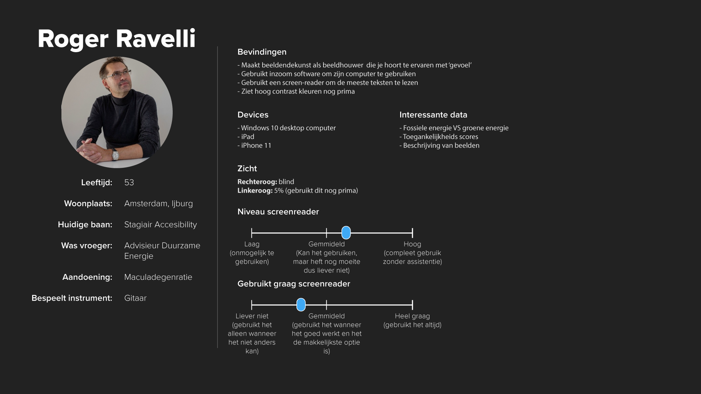

# Web Design @cmda-minor-web 1920

### Interactie ontwerpen: Rapid prototypen en testen met echte mensen
Speciaal voor Roger Ravelli heb ik een ontwerp gemaakt om hem tegemoet te komen bij de problemen die hij ondervind bij het gebruik van zijn computer voor bepaalde doeleinden.
Mijn focus hiervoor ligt op het begrijpbaar maken van grafieken voor Roger, aangezien roger een groot deel van zijn zicht niet meer kan gebruiken.
Dit doe ik door middel van `Exclusive Design`, het tegenovergestelde van `Inclusive Design`.

#### [Meer info over het proces vindt je in de wiki](https://github.com/aaraar/web-design-1920/wiki)

## Profiel Roger Ravelli

### Requirements
Requirements a.d.h.v. het profiel
1. Er moet interessante en echte data gevisualiseerd worden (bv. toeganklijkheidscijfers of groene energie cijfers)
1. Als er tekst in staat moet deze goed leesbaar en begrijpbaar zijn door Roger op zijn screenreaders op de iPad, iPhone en door supernova op windows
1. De basis informatie van de gehele website moet voor hem te begrijpen zijn zonder het gebruik van een screenreader
1. De interface moet duidelijk zichtbaar zijn voor Roger zodat hij nog wel het gedeeltelijke zicht dat hij nog heeft kan gebruiken
1. Hij moet de volledige controle over de applicatie en wat de applicatie eventueel zegt of laat zien hebben (Hij moet bijvoorbeeld altijd onderdelen kunnen starten en weer kunnen stoppen of sluiten)

## Inclusive Design
Ik heb de de applicatie specifiek voor Roger gemaakt a.d.h.v. de inclusive design principes. Deze zijn als volgt gebruikt

### Study situation
- Roger vindt het onwijs vervelend om de screenreader te gebruiken door de manier dat deze voorleest en hoe snel het gaat, daarom heb ik een eigen 'custom screenreader' toegevoegd die de website rustig en duidelijk voorleest wanneer hij dat wilt
- Roger vindt het heel verelend dat de screenreader te snel doorleest en niet stopt, dus ik heb twee toetsen toegevoegd waarmee roger de custom screenreader kan stoppen
- Roger kan nog deels zicht gebruiken en wil dit graag doen, maar kan dit alleen met veel contrast. Daarom is de site in hoog contrast gemaakt, maar is er altijd een audio optie voor als het niet goed zichtbaar is

### Ignore Conventions
- Het afspelen van geluid bij elke handeling wordt vaak afgekeurd. Dit kan heel vervelend zijn, maar Roger geeft aan af en toe wel een hint te kunnen gebruiken. Daarom heb ik er voor gekozen om veel geluid cue te gebruiken als backup. Met een vinger op de escape knop kan roger deze telkens annuleren.
- De grotere en dikke lettertypes, rode knoppen etc. geven veel visuele elementen dat afleidend kan zijn. Voor roger is dit van belang, want dan ziet hij dat er een object zit. Zonder dit contrast kijkt hij eroverheen.

### Prioritise identity
- Roger vondt het erg vervelend dat zijn naam nooit goed werd uitgesproken door screenreaders (franse uitspraak is correct). Daarom heb ik ervoor gezorgd dat zijn naam altijd door de franse stem wordt uitgesproken zodat de uitspraak wel naar zijn wens is.
- Bij veel data moet vaak context geplaatst worden zodat alle bezoekers begrijpen wat er gebeurd, bij deze applicatie is de data juist gericht op de kennis van Roger en vindt hij de extra uitleg juist vervelend dus laat ik alle kennis bij Roger en is er niet onwijs veel context bij wat voor data je nou ziet.

### Add nonsense
- Roger is vrij bot tegen de screenreader, de custom screenreader biedt dan ook aan om haar 'mond te laten snoeren, met een druk op de knop'
- De naam van Roger wordt nu overdreven Frans uitgesproken wat door Roger misschien wel erg opvalt na de opmerkingen dat zijn naam zo uitgesproken moet worden.

## Leerdoelen
- _Leren hoe je (design) principles in een ontwerp kan toepassen._
- _User needs begrijpen en gebruiken in je ontwerp._
- _Leren hoe je moet testen en de resultaten gebruiken voor het verbeteren van je ontwerp._

[Rubric](https://docs.google.com/spreadsheets/d/1no32c9YyAP78VMcqfA5i5at2OrxP9ce1d8dVGnii4Vs/)

Roger vond de grafiek ZEER duidelijk
Door hoog contrast, grote vormen en grote letters was het zelfs te begrijpen zonder Audio
Uit onderzoek van wouter alle tekst moet wit zijn

<!-- Add a link to your live demo in Github Pages 🌐-->

<!-- ☝️ replace this description with a description of your own work -->

<!-- replace the code in the /docs folder with your own, so you can showcase your work with GitHub Pages 🌍 -->

<!-- Add a nice poster image here at the end of the week, showing off your shiny frontend 📸 -->

<!-- Maybe a table of contents here? 📚 -->

<!-- How about a section that describes how to install this project? 🤓 -->

<!-- ...but how does one use this project? What are its features 🤔 -->

<!-- Maybe a checklist of done stuff and stuff still on your wishlist? ✅ -->

<!-- How about a license here? 📜 (or is it a licence?) 🤷 -->
