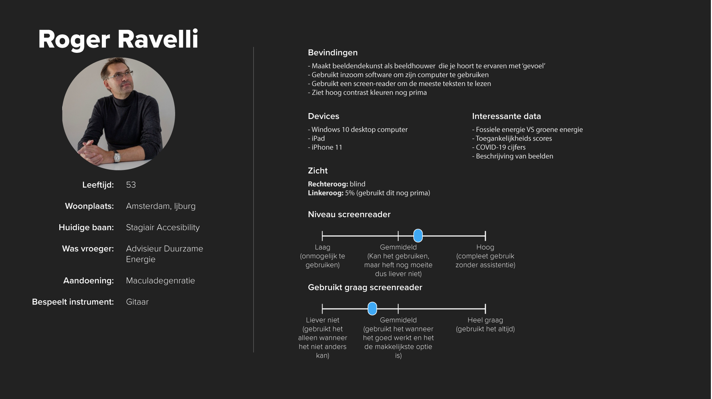

# Web Design @cmda-minor-web 1920
### Interactie ontwerpen: Rapid prototypen en testen met echte mensen

Web Design gaat over het ontwerpen en testen van Interactie. Het voordeel van een Frontend Developer (en Web Designer) is dat die techniek begrijpt, kan toepassen én verstand heeft van UX en design. Als je Web technieken begrijpt kun je je ideeën snel prototypen en testen met echte gebruikers, in een browser. Je kan dan aanpassingen doorvoeren, uitproberen en weer testen ...

In het vak Web design gaan we dingen ontwerpen voor echte mensen. Is er goede interactie? Kan je 'mens' je product op een prettige manier bedienen? Wat voor principes heb je gebruikt en getest? En zit er wel _nonsense_ in?

## Profiel Roger Ravelli

assumptive rendering

## Leerdoelen
- _Leren hoe je (design) principles in een ontwerp kan toepassen._
- _User needs begrijpen en gebruiken in je ontwerp._
- _Leren hoe je moet testen en de resultaten gebruiken voor het verbeteren van je ontwerp._

[Rubric](https://docs.google.com/spreadsheets/d/1no32c9YyAP78VMcqfA5i5at2OrxP9ce1d8dVGnii4Vs/)

<!-- Add a link to your live demo in Github Pages 🌐-->

<!-- ☝️ replace this description with a description of your own work -->

<!-- replace the code in the /docs folder with your own, so you can showcase your work with GitHub Pages 🌍 -->

<!-- Add a nice poster image here at the end of the week, showing off your shiny frontend 📸 -->

<!-- Maybe a table of contents here? 📚 -->

<!-- How about a section that describes how to install this project? 🤓 -->

<!-- ...but how does one use this project? What are its features 🤔 -->

<!-- Maybe a checklist of done stuff and stuff still on your wishlist? ✅ -->

<!-- How about a license here? 📜 (or is it a licence?) 🤷 -->
